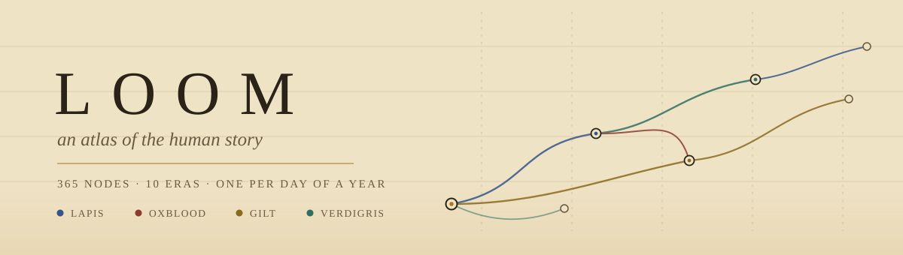
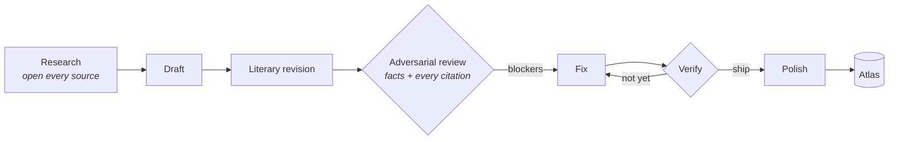

<picture>
  <source media="(prefers-color-scheme: dark)" srcset="assets/banner-dark.svg">
  <source media="(prefers-color-scheme: light)" srcset="assets/banner-light.svg">
  
</picture>

<p align="center">
  <a href="https://loomhistory.com"></a>
  
  
  
  
</p>

> World history as a chart you can walk, not a shelf you have to finish. Ten
> eras from the dawn of humanity to now, 365 nodes (one per day of a year),
> and behind each node a ten minute lesson that opens with a person rather
> than a date.

**Read it: [loomhistory.com](https://loomhistory.com)**

## What this is

Most history writing is a list. Loom is a graph. Every node carries forward
edges to later nodes with a stated reason, so the atlas argues that one thing
led to another instead of merely putting them in order. You can read it as a
sequence, follow a single pigment thread end to end, or start from something in
the present and walk backward to its roots.

It is a static site. Plain script tags, no build step, no dependencies, no
framework. It runs from `file://` if you double click `index.html`.

## How to read the chart

Time rises from the bottom of the parchment to the top. Regions are meridians
running down it, so the horizontal position of a node is roughly where on earth
it happened. Wires bend forward from cause to consequence, and they are colored
by the first thread of the node they leave.

| | Pigment | Thread | What it tracks |
|---|---|---|---|
|  | **Lapis** | Ideas & Belief | Philosophy, religion, ideology: what humans think the world is and what they owe each other |
|  | **Oxblood** | Power & Institutions | States, law, empires, revolutions: how humans organize coercion and consent |
|  | **Gilt** | Wealth & Exchange | Farms, trade, money, markets: why prosperity concentrates where it does |
|  | **Verdigris** | Craft & Science | Tools, techniques, theories: capability as a driver of everything else |

## What a lesson is

Ten minutes, in four movements. It opens cold inside a scene, through one
person's senses, and only then pulls back:

1. **The story.** A named person where the record allows one, a labeled
   composite where it does not. Çatalhöyük through a woman replastering a wall
   over her ancestors; Kanesh through a merchant's wife writing to complain the
   silver is late.
2. **The view from above.** So what, answered with mechanisms rather than
   vibes: why there, why then, what it caused, and how we know. Every lesson
   names at least one live scholarly disagreement and refuses to settle it.
3. **The threads.** Where this node connects, and why those two are one story.
4. **Five questions.** One recall, two on mechanism, and two callbacks that ask
   you to compare this node against one you read earlier. The callbacks are the
   point: they are what turns a sequence into a graph in your head.

## Evidence on demand

Every lesson carries per claim citations, and the page stays clean until you
want them. Press **Show the evidence** and a gilt superscript rises on every
sourced clause, with a gloss beneath the paragraph. The numbered Sources
cartouche at the foot is always visible.

The rule behind the apparatus is that a citation is only real once someone has
opened it. Every DOI is resolved against Crossref and every URL fetched before
it is attached to a sentence, because a live authoritative paper hung on a
claim it does not support passes any automated check and is worse than no
citation at all.

**1,074 sources. 1,312 markers. 76 percent open access.**

## The atlas so far

| Era | Span | Charted |
|---|---|---|
| **I** The Long Dawn | c. 300,000 to 10,000 BCE | `██████████` 20 / 20 |
| **II** Seeds & Cities | c. 10,000 to 1200 BCE | `██████████` 32 / 32 |
| **III** The Axial Age | c. 1200 to 200 BCE | `████░░░░░░` 13 / 34 |
| **IV** Empires & Faiths | c. 200 BCE to 600 CE | `███░░░░░░░` 9 / 34 |
| **V** The Believing World | c. 600 to 1100 CE | `███░░░░░░░` 13 / 38 |
| **VI** The Woven World | c. 1100 to 1450 CE | `██░░░░░░░░` 8 / 40 |
| **VII** The Great Convergence | 1450 to 1700 CE | `░░░░░░░░░░` 0 / 40 |
| **VIII** The Great Divergence | 1700 to 1870 CE | `░░░░░░░░░░` 0 / 42 |
| **IX** The World Machine | 1870 to 1945 CE | `░░░░░░░░░░` 0 / 42 |
| **X** The Unfinished Present | 1945 CE to now | `░░░░░░░░░░` 0 / 43 |

The graph is at its final size. What remains is writing.

## Run it

```bash
python3 -m http.server 4173
```

Then open http://localhost:4173. Opening `index.html` directly works too, since
nothing is fetched at runtime.

```bash
node scripts/check.mjs                 # the gate: structure, prose bounds, citations, no dashes
node scripts/check.mjs data/lessons/<id>.js   # one lesson
node scripts/check-links.mjs [<id> ...]       # link health, hits the network
```

The gate must be green before any commit.

## How a lesson gets written

Lessons are forged by a pipeline of language models with one hard rule: **the
critic is never the same model as the creator.** One model researches and
writes, a different one attacks the result.



The review stage is not ceremony. It has caught a fabricated stance attributed
to a living scholar, a superseded dating, an arithmetic error two earlier
passes missed, a quotation printed without marking that one word was an
editorial restoration, and a source cited for a claim its own page explicitly
denies. Several times it found the error in the graph data rather than in the
prose, and the fix landed in the atlas itself.

## Architecture

| Path | What lives there |
|---|---|
| `index.html` | The shell. Loads everything through plain script tags |
| `styles.css` | The whole design system. Parchment and ink, four pigments, `body.lamplight` for night |
| `data/graph-core.js` | Registry: threads, regions, eras, nodes, lessons |
| `data/eras/01..10-*.js` | The graph itself. Array order is reading order; edges point forward only |
| `data/lessons/<id>.js` | One written lesson per file |
| `data/worldmap.js` | Natural Earth land as a single public domain SVG path |
| `js/map.js` | The chart: era bands, meridians, bezier wires, pan and zoom, filters |
| `js/reader.js` | Dossier, reading room, questions, and the citation apparatus |
| `js/paths.js` | Thread walks and roots walks |
| `scripts/check.mjs` | The gate |

## House rules

- **No build step.** Plain globals and script tags, so the atlas keeps working
  from a flat directory in twenty years.
- **No em dashes**, anywhere, in any prose. The gate enforces it.
- **Node ids are permanent.** Lessons, edges and reading progress all key on
  them.
- **The gate cannot read English.** It proves structure, never truth. That is
  what the adversarial pass is for.

---

<p align="center"><i>Built for one reader, in the open.</i></p>
